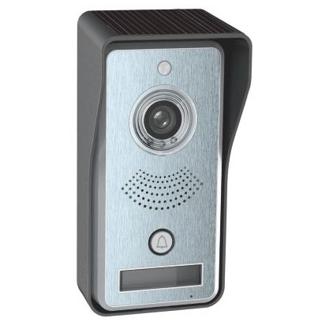

# RL-IP02

* SoC: GOKE GK7102
* Flash: SPI flash, W25Q128JV (W25Q128FV reported by U-Boot) - 128Mbit / 16MB
* Serial: RX0-TX0 located on the side of the PCB, marked clearly, 115200 baud - 0 sec u-boot auto wait
* U-Boot: U-Boot 2012.10 (Dec 15 2017 - 16:03:10) for B/A17W IPBOX tw9912 (RL)
* WiFi: Mediatek MT7601 (?)
* LAN: HanRun HR681686 (?)

#### Flash layout:
* MTD defined layout:
	* 0x000000-0x040000 : "uboot"
	* 0x040000-0x050000 : "ubootenv"
	* 0x050000-0x070000 : "user"
	* 0x070000-0x0e0000 : "config"
	* 0x0e0000-0x280000 : "kernel"
	* 0x280000-0x630000 : "rootfs" (SquashFS)
	* 0x630000-0x800000 : "resource" (SquashFS - Contains 8bit 8kHz ALAW sound files for notifications and alerts)
	* 0x000000-0x800000 : "all"

* Backup / factory firmware (flashed to the partitions above when the reset button is held on powerup):
	* 0x8E0000 : "kernel"
	* 0xA80000 : "rootfs"
	* 0xE30000 : "resource"

#### Resources:
* U-Boot startuplog: Logs/uboot.txt
* Binwalk on the flash dump: Logs/binwalk.txt
* MTD flashlayout: Logs/flash_layout_mtd.txt
* Factory rootfs and resourcefs located in the "FileSystems" folder.

#### Linux users:
* root/("*plKJ0ox4sO46Y*" hashed password - unhashed: *unknown*)
* default/(no password)

#### Rooting:
Flash the modified rootfs from "FileSystems/rooted-rootfs.squashfs" to the "rootfs" partition on the flash

The root password is now blank/removed, so the login is "root" and no password.

### Device
